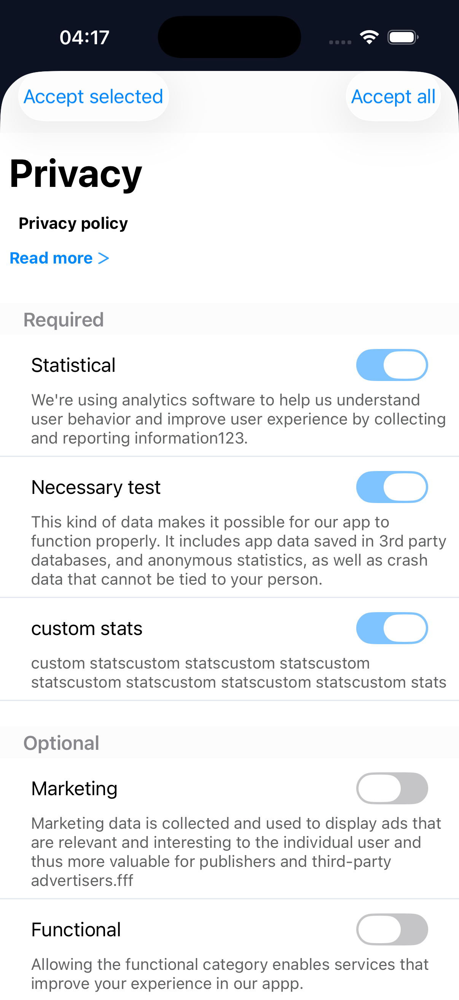
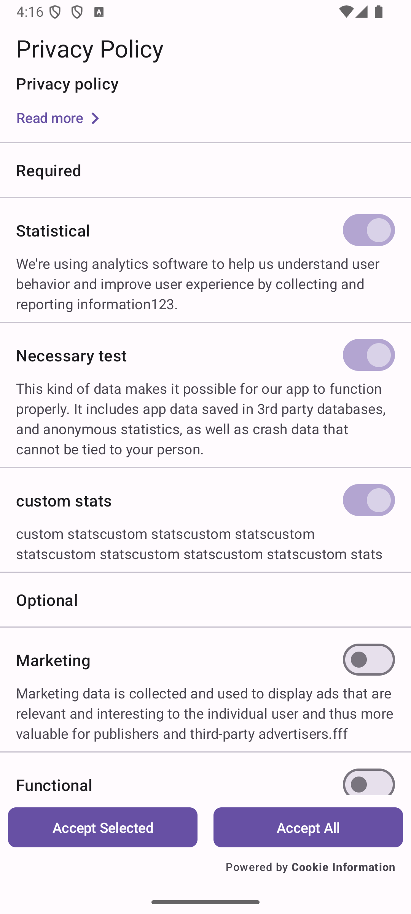

# Cookie Information React Native SDK

React Native wrapper for the Cookie Information Mobile Consents SDKs.

Native SDKs:
- Android: https://github.com/cookie-information/android-release
- iOS: https://github.com/cookie-information/ios-release

## Requirements

| Requirement | Version |
| --- | --- |
| `react` (peer dependency) | `>=19.0.0 <20` |
| `react-native` (peer dependency) | `>=0.79.0 <0.87.0` |
| Node.js | `>=20` |
| iOS | 15.1+ |
| Android | API level 21+ (minSdk 21) |

## Installation

Install the package in your React Native app.

```bash
npm install @cookieinformation/react-native-sdk
# or
yarn add @cookieinformation/react-native-sdk
```

iOS: run `cd ios && pod install`.
Android: no extra install step is required; rebuild the app (Gradle autolinking).

## Initializing

Initialize the SDK before calling any other method. You can initialize with or without UI customization.
SDK credentials can be fetched from the Cookie Information platform: https://go.cookieinformation.com/login

The SDK uses the `languageCode` you pass during initialization for all UI components and ignores the system language. If `languageCode` is not set, the SDK uses the device locale. You must ensure the selected language is configured in the Cookie Information platform and that content is provided for that language.

Recommended flow: initialize once, then call `showPrivacyPopUpIfNeeded` when needed (typically on app start).

Minimum required data for initialization:
- `clientId`
- `clientSecret`
- `solutionId`

```ts
import MobileConsent from '@cookieinformation/react-native-sdk';

await MobileConsent.initialize({
  clientId: 'YOUR_CLIENT_ID',
  clientSecret: 'YOUR_CLIENT_SECRET',
  solutionId: 'YOUR_SOLUTION_ID',
});
```

Here is an example of all the arguments and data that support the SDK:

```ts
await MobileConsent.initialize({
  clientId: 'YOUR_CLIENT_ID',
  clientSecret: 'YOUR_CLIENT_SECRET',
  solutionId: 'YOUR_SOLUTION_ID',
  languageCode: 'EN',        // optional
  enableNetworkLogger: false, // iOS only
  ui: {
    ios: {
      accentColor: '#2E5BFF',
      fontSet: {
        largeTitle: { size: 34, weight: 'bold' },
        body: { size: 14, weight: 'regular' },
        bold: { size: 14, weight: 'bold' },
      },
    },
    android: {
      lightColorScheme: {
        primary: '#FF0000',
        secondary: '#FFFF00',
        tertiary: '#FFC0CB',
      },
      darkColorScheme: {
        primary: '#00FF00',
        secondary: '#008000',
        tertiary: '#000000',
      },
      typography: {
        bodyMedium: { font: 'inter_regular', size: 14 },
      },
    },
  },
});
```

Notes:
- Android `font` is a resource name under `android/app/src/main/res/font`.
- Colors accept `#RRGGBB` or `#AARRGGBB`.
- iOS uses system fonts if `name` is omitted.

## Using built-in mobile consents UI

SDK contains built-in screens for managing consents. Please ensure you set the correct language code you expect the consents to use, and that it has been fully configured in the Cookie Information platform.

| iOS | Android |
| --- | --- |
|  |  |

## Privacy Pop-Up

### Standard flows

#### Presenting the privacy pop-up

To show the Privacy Pop Up screen regardless of state, use `showPrivacyPopUp` (typically used in settings to allow modification of consent). To show the Privacy Pop Up screen only when the user has not consented to the latest version, use `showPrivacyPopUpIfNeeded` (typically used at startup to present the privacy screen conditionally; see more below).

```ts
showPrivacyPopUp(): Promise<TrackingConsents>
```

```ts
const consents = await MobileConsent.showPrivacyPopUp();
// Returns TrackingConsents.
// Keys are consent category types (e.g. necessary, marketing).
// Values are true if accepted, false if declined, or undefined if not set.
// Example return shape:
// {
//   necessary: true,
//   functional: false,
//   statistical: true,
//   marketing: false,
//   custom: true
// }
// Use the result to enable/disable SDKs
if (consents.marketing) {
  // enable marketing SDKs
} else {
  // disable marketing SDKs
}
```

The above function resolves with the user’s selections (a key/value map of consent categories to booleans). Use this result to enable or disable third‑party SDKs based on consent.

### Presenting the privacy pop-up conditionally

`showPrivacyPopUpIfNeeded` is typically used to present the popup after app start (or at a point you choose). The method checks if a valid consent is already saved locally on the device and also checks if there are any updates on the Cookie Information server. If there is no consent saved or the consent version is different from the one available on the server, the popup is presented; otherwise it resolves immediately with the current consent data. Use `ignoreVersionChanges` to ignore consent version changes coming from the server (iOS only).

```ts
showPrivacyPopUpIfNeeded(
  options?: { ignoreVersionChanges?: boolean; userId?: string | null }
): Promise<TrackingConsents>
```

```ts
const consents = await MobileConsent.showPrivacyPopUpIfNeeded();
// Returns TrackingConsents.
// Keys are consent category types (e.g. necessary, marketing).
// Values are true if accepted, false if declined, or undefined if not set.
// Example return shape:
// {
//   necessary: true,
//   functional: false,
//   statistical: true,
//   marketing: false,
//   custom: true
// }
// Use the result to enable/disable SDKs
if (consents.marketing) {
  // enable marketing SDKs
} else {
  // disable marketing SDKs
}
```

With options (Android `userId`, iOS `ignoreVersionChanges`):

```ts
const consents = await MobileConsent.showPrivacyPopUpIfNeeded({
  ignoreVersionChanges: true, // iOS only
  userId: 'user_123', // optional on Android
});

// Example: read custom consent category
if (consents.custom) {
  // handle custom consent item
}
```

### Handling errors

Both `showPrivacyPopUp` and `showPrivacyPopUpIfNeeded` reject on error. If an error happens, the selection is still persisted locally and an attempt is made the next time `showPrivacyPopUpIfNeeded` or `synchronizeIfNeeded` is called.

```ts
try {
  await MobileConsent.showPrivacyPopUpIfNeeded();
} catch (e) {
  console.warn('Consent UI failed, retry later:', e);
  // You can call showPrivacyPopUpIfNeeded() again later (e.g. next app start).
}
```

## Custom view

If the default consent UI does not fit your product, you can build your own custom view. Use the methods below to fetch the consent solution and submit the user’s choices.

All methods return Promises and must be called after `initialize()`.

### initialize
Initialize the native SDKs before calling any other method; it refreshes SDK setup and clears the cached consent solution template, which is repopulated on the next `cacheConsentSolution` or consent UI call. It does not clear stored user consent choices; use `removeStoredConsents` to reset those.

```ts
initialize(options: InitializeOptions): Promise<void>
```

### cacheConsentSolution

Fetches the latest consent solution from the server and caches it for custom UI flows. Use the returned items to build your own UI if needed.

Your app needs the consent solution configuration (items, version) to build custom UI and to save choices. `cacheConsentSolution` fetches that configuration from the server and stores a snapshot; it does not hold the user’s accept/decline selections—those are saved when you post consents via `saveConsents` or the built-in UI, and read with `getSavedConsents`. When using custom UI, call `cacheConsentSolution` first, then pass items with updated `accepted` values to `saveConsents`. `initialize` clears the solution template cache (repopulated on the next `cacheConsentSolution` or consent UI call); `removeStoredConsents` clears stored user choices only.

```ts
cacheConsentSolution(): Promise<ConsentItem[]>
```

```ts
const consentItems = await MobileConsent.cacheConsentSolution();
// Return type: ConsentItem[]

// Example usage: build your own UI from consentItems
const itemsForUi = consentItems.map((item) => ({
  id: item.id,
  title: item.title,
  required: item.required,
  accepted: item.accepted,
}));
```

### saveConsents

Submits the selected consent items to the server and stores them locally.

Parameters:
- `consentItems`: List of items to save. You can pass `ConsentItem[]` directly from `cacheConsentSolution` or `getSavedConsents` to `saveConsents` on both platforms. The SDK reads only two fields from each item: the identifier (`id` on Android, `universalId` on iOS) and `accepted`. All other fields are ignored.
- `customData`: Optional custom data (e.g. email, device_id). iOS only; ignored on Android.
- `userId`: Android only, optional user id; omit or pass `null` for anonymous user. Ignored on iOS.

```ts
saveConsents(
  consentItems: ConsentItem[],
  customData?: Record<string, string> | null,
  userId?: string | null
): Promise<SaveConsentsResponse>
```

```ts
const consentItems = await MobileConsent.cacheConsentSolution();

await MobileConsent.saveConsents(
  consentItems,
  { device_id: 'example-device' },
  'user_123' // optional userId on Android
);
```

Notes:
- `userId` is optional on Android; pass `null` or omit for anonymous user.
- Call `cacheConsentSolution` first, then pass items (with updated `accepted` values) to `saveConsents`. A prior cache is required on both platforms.

### getSavedConsents

`getSavedConsents` returns consent items stored on the device.
- Android: Returns items from the local DB (cached solution + user choices). Items may exist after `cacheConsentSolution` even before the user selects anything.
- iOS: Returns only consents that were saved when the user submitted choices (e.g. via the consent dialog or `saveConsents`). Empty until the user completes the flow at least once.

Parameters:
- `userId`: Android only, optional user id; omit or pass `null` for anonymous user. Ignored on iOS.

```ts
getSavedConsents(userId?: string | null): Promise<ConsentItem[]>
```

```ts
const consentItems = await MobileConsent.getSavedConsents();
// Return type: ConsentItem[]
```

### acceptAllConsents
Accepts all consent categories as accepted, then saves the result to the server and local storage. Uses the consent solution configuration the SDK has loaded (from `initialize` and, when used, `cacheConsentSolution`).

Parameters:
- `userId`: Android only, optional user id; omit or pass `null` for anonymous user. Ignored on iOS.

```ts
acceptAllConsents(userId?: string | null): Promise<AcceptAllConsentsResponse>
```

### removeStoredConsents
Removes the user's saved consent choices from the device. Does not delete server-side consent records.

Parameters:
- `userId`: Android only, optional user id; omit or pass `null` for anonymous user. Ignored on iOS.

```ts
removeStoredConsents(userId?: string | null): Promise<void>
```

### synchronizeIfNeeded
Retries failed consent uploads.

```ts
synchronizeIfNeeded(): Promise<void>
```

## Types (summary)

Returned by `showPrivacyPopUp` and `showPrivacyPopUpIfNeeded` (see Privacy Pop-Up examples above). Keys are consent category ids (same as `ConsentItem.type`); values are `true` (accepted), `false` (declined), or `undefined` if not set. Import as `TrackingConsents`:

```ts
{
  necessary?: boolean;
  marketing?: boolean;
  statistical?: boolean;
  functional?: boolean;
  custom?: boolean;
  [key: string]: boolean | undefined; // e.g. "privacy policy"
}

One consent purpose from your solution. Returned by `getSavedConsents`, `cacheConsentSolution`, `acceptAllConsents`, and `saveConsents`.

You can pass `ConsentItem[]` directly from `cacheConsentSolution` or `getSavedConsents` to `saveConsents` on both platforms. The SDK reads only two fields from each item: the identifier (`id` on Android, `universalId` on iOS) and `accepted`. All other fields are ignored. On iOS, returned items always have `id: 0`; use `universalId` as the consent item identifier.

```ts
interface ConsentItem {
  id: number;
  universalId: string;
  title: string;
  description: string;
  required: boolean;
  type: string;
  accepted: boolean;
}
```

interface SaveConsentsResponse {
  success: boolean;
  savedCount: number;
  consents: ConsentItem[];
}
```

## Logging

Enable network logging on iOS via `enableNetworkLogger: true` in `initialize()`.

## Developing this package

From the repository root:

```bash
npm install
npm run lint
npm run typescript
npm test
npm run build
```

## Running the example app

The example app lives in `example/` and uses bare React Native (native build required).

```bash
# from repo root
npm install
cd example
npm install
cd ios && pod install && cd ..

# Metro (separate terminal)
npm start

# run on device/simulator
npm run ios
# or
npm run android
```

Notes:
- Update the credentials in `example/App.tsx` before running.

## Notes

- Call `initialize()` before any other method.

## Implementation

For additional customization options within MobileConsentsSDK, please contact our support team.

If something is missing or you want to change something, let us know.

## Release automation

- Release tags must match the `package.json` version (format `X.Y.Z`).
